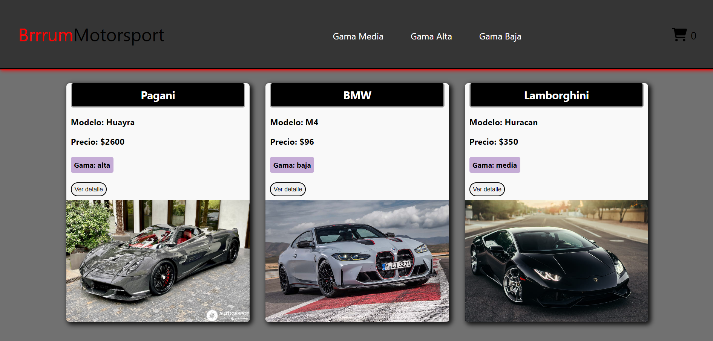
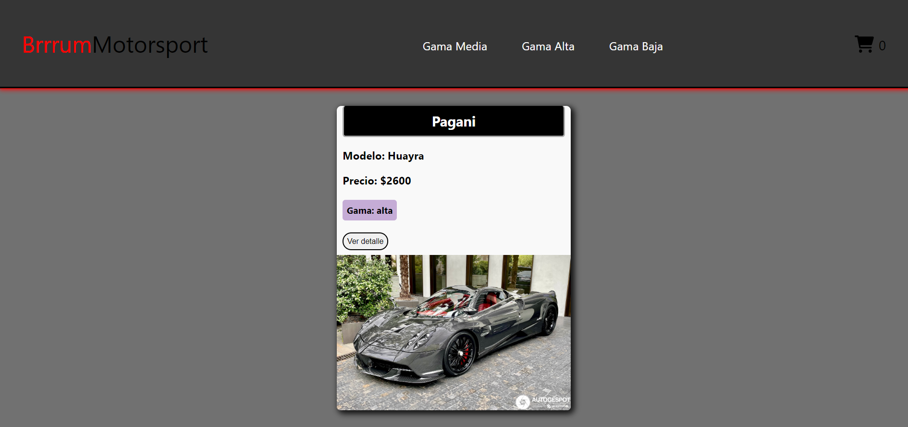
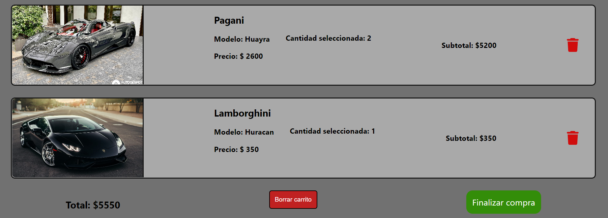

# E-Commerce Autos de lujo

El proyecto gira en torno a una App web que simula el funcionamiento de un E-Commerce, en este caso, de Autos de lujo. El usuario tiene la opción de recorrer la app y agregar productos a su carrito, simulando una compra.

### Inicio



### Categorías



### Carrito



## Librerías utilizadas

- [Firebase](https://firebase.google.com/?hl=es-419&gclid=CjwKCAjwtp2bBhAGEiwAOZZTuFaxRrgo7rQfgeEN6zbhZ-QcMQpe6J8BD1kmqcGbYj4cvDMzpqndvBoCXcQQAvD_BwE&gclsrc=aw.ds)\
  Se utilizó para generar una base de datos para los productos, crear un menú de navegación dinámico con las distintas categorías de los productos y generar ordenes de compra con un id de seguimiento.

- [React-router-dom](https://www.npmjs.com/package/react-router-dom)\
  Esta librería permite agilizar y simplificar el entramado de las rutas en todo el proyecto.
- [FontAwesome](https://fontawesome.com/icons)\
  Librería con miles de íconos de todo tipo para utilizar en cualquier proyecto. Pueden utilizarse simplemente por estética (ícono de un carrito en el menú) y también para funcionalidades (reemplazando botones).

#### This project was bootstrapped with [Create React App](https://github.com/facebook/create-react-app).

## Funcionalidades del proyecto

- Mostrar productos en el Inicio o en distintas secciones filtrando por categoría
- Ver detalle de cada producto a través de un botón
- Agregar y quitar productos en un carrito
- Borrar el carrito entero
- Finalización de la compra con un formulario que toma los datos del usuario y le brinda un id de seguimiento de la misma

## Correr el proyecto en local

1. Clonar el repositorio

```
git clone https://github.com/bautistaSanchezCavanna/ProyectoEcommerce-SanchezCavanna.git
```

2. Abrirlo en un editor de código e instalar las dependencias

```
npm install
```

3. Correr el proyecto en local. Se abrirá en el navegador como [http://localhost:3000](http://localhost:3000).

```
npm start
```


